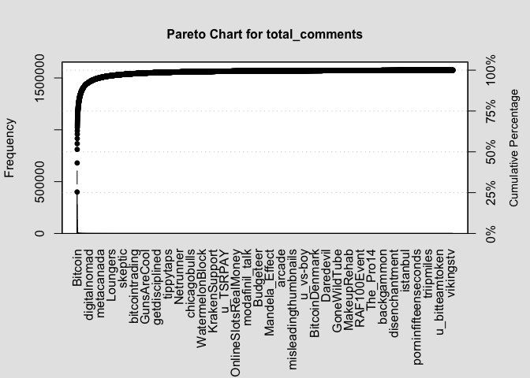

Regression Analysis
================
2023-03-29

# Data Preparation

``` r
suppressPackageStartupMessages({
library(vctrs)
library(rlang)
library(kernlab)
library(crypto2)
library('lubridate')
library('dplyr')
library(reshape2)
library(glue)
library(qcc)
library(tidyverse)
library(data.table)})
```

## Twitter Data

``` r
twitter.raw <- read.csv('../Data/twitter_data.csv', sep = ';')
str(twitter.raw)
```

    ## 'data.frame':    12936 obs. of  16 variables:
    ##  $ Date                  : chr  "2017-08-01 00:00:00" "2017-08-01 01:00:00" "2017-08-01 02:00:00" "2017-08-01 03:00:00" ...
    ##  $ Compound_Score        : num  0.0829 0.0532 0.1243 -0.021 0.0554 ...
    ##  $ Total.Volume.of.Tweets: num  1027 778 836 984 751 ...
    ##  $ Count_Negatives       : num  139 111 89 250 114 120 125 120 142 134 ...
    ##  $ Count_Positives       : num  347 193 273 236 195 286 227 236 215 188 ...
    ##  $ Count_Neutrals        : num  397 320 264 314 305 303 290 348 368 427 ...
    ##  $ Sent_Negatives        : num  -0.517 -0.423 -0.441 -0.441 -0.415 ...
    ##  $ Sent_Positives        : num  0.418 0.415 0.429 0.396 0.417 ...
    ##  $ Count_News            : num  695 493 510 683 517 563 525 595 589 636 ...
    ##  $ Count_Bots            : num  144 154 210 184 137 133 135 159 354 238 ...
    ##  $ Open                  : num  2856 2823 2846 2842 2863 ...
    ##  $ High                  : num  2863 2860 2858 2864 2876 ...
    ##  $ Low                   : num  2823 2821 2837 2838 2848 ...
    ##  $ Close                 : num  2826 2853 2842 2863 2875 ...
    ##  $ Volume..BTC.          : num  184 77.3 135.8 143.2 222.5 ...
    ##  $ Volume..Currency.     : num  522951 219605 386739 408360 637046 ...

``` r
twitter.hourly <- twitter.raw[,1:10]
str(twitter.hourly) 
```

    ## 'data.frame':    12936 obs. of  10 variables:
    ##  $ Date                  : chr  "2017-08-01 00:00:00" "2017-08-01 01:00:00" "2017-08-01 02:00:00" "2017-08-01 03:00:00" ...
    ##  $ Compound_Score        : num  0.0829 0.0532 0.1243 -0.021 0.0554 ...
    ##  $ Total.Volume.of.Tweets: num  1027 778 836 984 751 ...
    ##  $ Count_Negatives       : num  139 111 89 250 114 120 125 120 142 134 ...
    ##  $ Count_Positives       : num  347 193 273 236 195 286 227 236 215 188 ...
    ##  $ Count_Neutrals        : num  397 320 264 314 305 303 290 348 368 427 ...
    ##  $ Sent_Negatives        : num  -0.517 -0.423 -0.441 -0.441 -0.415 ...
    ##  $ Sent_Positives        : num  0.418 0.415 0.429 0.396 0.417 ...
    ##  $ Count_News            : num  695 493 510 683 517 563 525 595 589 636 ...
    ##  $ Count_Bots            : num  144 154 210 184 137 133 135 159 354 238 ...

``` r
twitter.hourly$Date <- ymd_hms(twitter.hourly$Date)
head(twitter.hourly)
```

    ##                  Date Compound_Score Total.Volume.of.Tweets Count_Negatives
    ## 1 2017-08-01 00:00:00     0.08289332                   1027             139
    ## 2 2017-08-01 01:00:00     0.05315978                    778             111
    ## 3 2017-08-01 02:00:00     0.12425080                    836              89
    ## 4 2017-08-01 03:00:00    -0.02103650                    984             250
    ## 5 2017-08-01 04:00:00     0.05543746                    751             114
    ## 6 2017-08-01 05:00:00     0.09344372                    842             120
    ##   Count_Positives Count_Neutrals Sent_Negatives Sent_Positives Count_News
    ## 1             347            397     -0.5166201      0.4178818        695
    ## 2             193            320     -0.4234018      0.4153850        493
    ## 3             273            264     -0.4409382      0.4286612        510
    ## 4             236            314     -0.4411732      0.3960343        683
    ## 5             195            305     -0.4149781      0.4171595        517
    ## 6             286            303     -0.4249658      0.4099563        563
    ##   Count_Bots
    ## 1        144
    ## 2        154
    ## 3        210
    ## 4        184
    ## 5        137
    ## 6        133

``` r
min_date <- min(twitter.hourly$Date)
max_date <- max(twitter.hourly$Date)
#minus one as date filter below is exclusive not inclusive
min_date.string <- format(min_date - 1, '%Y%m%d')  
max_date.string <- format(max_date, '%Y%m%d')
```

Looks like we have some NA values that we will need to deal with.

Let’s go ahead an aggregate into daily values as well.

``` r
# build a new dataframe with 0's for the NA values so we can sum accros them
names(twitter.hourly)[names(twitter.hourly) == 'Date'] <- 'datetime'

twitter.hourly$day <- ymd(format(twitter.hourly$datetime, '%Y-%m-%d'))

twitter.daily <- twitter.hourly[is.na(twitter.hourly$Compound_Score) == F,] %>%                        group_by(day)  %>%
                    summarise(total_tweets = sum(Total.Volume.of.Tweets),
                              positive_tweets = sum(Count_Positives),
                              negative_tweets = sum(Count_Negatives),
                              neutral_tweets = sum(Count_Neutrals),
                              sent_negatives = mean(Sent_Negatives),
                              Sent_positives = mean(Sent_Positives),
                              .groups = 'drop')
head(twitter.daily)
```

    ## # A tibble: 6 × 7
    ##   day        total_tweets positive_tweets negative_tweets neutral_tweets
    ##   <date>            <dbl>           <dbl>           <dbl>          <dbl>
    ## 1 2017-08-01        30802            6471            4701          12089
    ## 2 2017-08-02        23726            4734            2732           9063
    ## 3 2017-08-03        25111            5351            3233           9806
    ## 4 2017-08-04        21863            4150            2703           7959
    ## 5 2017-08-05        22123            6258            2115           8731
    ## 6 2017-08-06        15469            3754            2190           6161
    ## # ℹ 2 more variables: sent_negatives <dbl>, Sent_positives <dbl>

``` r
#rename some columns for consistency
names(twitter.hourly)[names(twitter.hourly) == 'Total.Volume.of.Tweets'] <- 'total_tweets'
names(twitter.hourly)[names(twitter.hourly) == 'Count_Positives'] <- 'positive_tweets'
names(twitter.hourly)[names(twitter.hourly) == 'Count_Negatives'] <- 'negative_tweets'
names(twitter.hourly)[names(twitter.hourly) == 'Count_Neutrals'] <- 'neutral_tweets'
```

## Bitcoin Data

For the crypto data, we will handle this by getting our crypto pricing
info from another source. We will use the package crypto2 to source this
data.

``` r
if (file.exists('../Data/bitcoin_daily.csv') == FALSE)
  {

   bitcoin.daily <- crypto_history(
                                  # coin_list = 'BTC',
                                  convert = "USD",
                                  limit = 1,
                                  start_date = min_date.string,
                                  end_date = max_date.string,
                                  interval = 'daily',
                                  sleep = 0,
                                  finalWait = FALSE
                                  )
   
   bitcoin.daily$timestamp <- ymd(
     format(
       ymd_hms(
         bitcoin.daily$timestamp), '%Y%m%d'))
   
   colnames(bitcoin.daily)[1] <- 'day'
   
   write.csv(bitcoin.daily, "../Data/bitcoin_daily.csv")
   
} else 
  {
  bitcoin.daily <- read.csv("../Data/bitcoin_daily.csv")
  bitcoin.daily$day <- ymd(bitcoin.daily$day)
  }

head(bitcoin.daily)
```

    ##   X        day id    slug    name symbol ref_cur    open    high     low
    ## 1 1 2017-08-01  1 bitcoin Bitcoin    BTC     USD 2871.30 2921.35 2685.61
    ## 2 2 2017-08-02  1 bitcoin Bitcoin    BTC     USD 2727.13 2762.53 2668.59
    ## 3 3 2017-08-03  1 bitcoin Bitcoin    BTC     USD 2709.56 2813.31 2685.14
    ## 4 4 2017-08-04  1 bitcoin Bitcoin    BTC     USD 2806.93 2899.33 2743.72
    ## 5 5 2017-08-05  1 bitcoin Bitcoin    BTC     USD 2897.63 3290.01 2874.83
    ## 6 6 2017-08-06  1 bitcoin Bitcoin    BTC     USD 3257.61 3293.29 3155.60
    ##     close     volume  market_cap  time_open          time_close
    ## 1 2718.26 1324669952 44804603884 2017-08-01 2017-08-01 23:59:59
    ## 2 2710.67 1094950016 44684649516 2017-08-02 2017-08-02 23:59:59
    ## 3 2804.73  804796992 46239970790 2017-08-03 2017-08-03 23:59:59
    ## 4 2895.89 1002120000 47749461443 2017-08-04 2017-08-04 23:59:59
    ## 5 3252.91 1945699968 53643452554 2017-08-05 2017-08-05 23:59:59
    ## 6 3213.94 1105030016 53006426108 2017-08-06 2017-08-06 23:59:59
    ##             time_high            time_low
    ## 1 2017-08-01 05:39:51 2017-08-01 13:49:43
    ## 2 2017-08-02 12:54:40 2017-08-02 15:19:55
    ## 3 2017-08-03 22:24:46 2017-08-03 02:10:06
    ## 4 2017-08-04 23:54:37 2017-08-04 01:49:40
    ## 5 2017-08-05 17:49:16 2017-08-05 00:39:42
    ## 6 2017-08-06 01:29:16 2017-08-06 08:19:16

It looks like we are having trouble extracting the bitcoin price at an
hourly interval. This package only supports daily intervals. As such, we
must get our data from another source. The most obvious choice is using
the bitcoin price that was included in the Twitter data. We will discuss
why we chose this further on under the heading “Handling missing data”.

``` r
bitcoin.hourly <- twitter.raw[,c(1,11,12,13,14,15,16)]
names(bitcoin.hourly)[names(bitcoin.hourly) == 'Date'] <- 'datetime'
names(bitcoin.hourly) <- tolower(names(bitcoin.hourly))
bitcoin.hourly$datetime <- ymd_hms(bitcoin.hourly$datetime)
str(bitcoin.hourly)
```

    ## 'data.frame':    12936 obs. of  7 variables:
    ##  $ datetime         : POSIXct, format: "2017-08-01 00:00:00" "2017-08-01 01:00:00" ...
    ##  $ open             : num  2856 2823 2846 2842 2863 ...
    ##  $ high             : num  2863 2860 2858 2864 2876 ...
    ##  $ low              : num  2823 2821 2837 2838 2848 ...
    ##  $ close            : num  2826 2853 2842 2863 2875 ...
    ##  $ volume..btc.     : num  184 77.3 135.8 143.2 222.5 ...
    ##  $ volume..currency.: num  522951 219605 386739 408360 637046 ...

## Reddit Data

Now we need to bring in the data around sentiment analysis for Reddit
comments.

``` r
reddit.hourly <- read.csv('../Data/reddit_agg_by_hour.csv')
reddit.hourly.subreddit <- read.csv('../Data/reddit_agg_by_subreddit_by_hour.csv')

reddit.hourly$datetime <- ymd_hms(reddit.hourly$datetime)
reddit.hourly.subreddit$datetime <- ymd_hms(reddit.hourly.subreddit$datetime)
names(reddit.hourly.subreddit)[names(reddit.hourly.subreddit) == "unique_items"] <- "total_comments"

# rename some columns

names(reddit.hourly)[names(reddit.hourly) == 'created_utc'] <- 'total_reddit'
names(reddit.hourly)[names(reddit.hourly) == 'positive'] <- 'positive_reddit'
names(reddit.hourly)[names(reddit.hourly) == 'negative'] <- 'negative_reddit'
names(reddit.hourly)[names(reddit.hourly) == 'neutral'] <- 'neutral_reddit'

names(reddit.hourly.subreddit)[names(reddit.hourly.subreddit) == 'total_comments'] <- 'total_reddit'
names(reddit.hourly.subreddit)[names(reddit.hourly.subreddit) == 'positive'] <- 'positive_reddit'
names(reddit.hourly.subreddit)[names(reddit.hourly.subreddit) == 'negative'] <- 'negative_reddit'
names(reddit.hourly.subreddit)[names(reddit.hourly.subreddit) == 'neutral'] <- 'neutral_reddit'
```

Lets go ahead and do some transformations on it, in case we want to do
analysis at different intervals like a daily interval.

``` r
reddit.hourly$day <- ymd(format(reddit.hourly$datetime, '%Y-%m-%d'))
reddit.daily <- reddit.hourly %>% group_by(day)  %>%
                    summarise(total_reddit = sum(total_reddit),
                              positive_reddit = sum(positive_reddit),
                              negative_reddit = sum(negative_reddit),
                              neutral_reddit = sum(neutral_reddit),
                              .groups = 'drop')

reddit.hourly.subreddit$day <- ymd(format(reddit.hourly.subreddit$datetime, '%Y-%m-%d'))
reddit.daily.subreddit <- reddit.hourly.subreddit %>% group_by(day, subreddit)  %>%
                                summarise(total_reddit = sum(total_reddit),
                                positive_reddit = sum(positive_reddit),
                                negative_reddit = sum(negative_reddit),
                                neutral_reddit = sum(neutral_reddit),
                                .groups = 'drop')


nrow(reddit.daily.subreddit)
```

    ## [1] 158955

We now have our reddit data imported and aggregated at the correct
levels. However, the dataset disaggregated by subreddit is very very
large.

``` r
print(glue("{nrow(reddit.daily.subreddit)} total rows,
           {length(unique(reddit.daily.subreddit$subreddit))} total unique subreddits"))
```

    ## 158955 total rows,
    ## 11633 total unique subreddits

Lets explore how frequently each of the subreddits get comments.

``` r
reddit.daily.subreddit.totals <- reddit.hourly.subreddit %>% group_by(subreddit)  %>%                                     summarise(total_reddit = sum(total_reddit),
                                                   positive_reddit = sum(positive_reddit),
                                                   negative_reddit = sum(negative_reddit),
                                                   neutral_reddit = sum(neutral_reddit),
                                                         .groups = 'drop')
reddit.daily.subreddit.totals <- reddit.daily.subreddit.totals[
  order(-reddit.daily.subreddit.totals$total_reddit),]

total_comments <- reddit.daily.subreddit.totals[["total_reddit"]]
names(total_comments) <- reddit.daily.subreddit.totals[["subreddit"]]

total_comments.pareto <- pareto.chart(total_comments, plot=F)
plot(total_comments.pareto)
```

<!-- -->

From this pareto chart, we can see that a small number of subreddit make
up the bulk of the total comments.

For example, lets look at the top 10 subreddits and see how much percent
of the total number of comments they make up.

``` r
cutoff <- 10
print(glue("The top {cutoff} items represent {round(data.frame(total_comments.pareto[cutoff,])['Cum.Percent.',],2)}% of the subreddits."))
```

    ## The top 10 items represent 66.63% of the subreddits.

As such, 10 out of 11k subreddits represent 66.6% of comments about
bitcoin. As such, it is reasonable to use only these subreddits for our
analysis.

``` r
top_ten_subs <- row.names(total_comments.pareto)[0:10]
reddit.daily.subreddit.top10 <- filter(reddit.daily.subreddit,
                       subreddit %in% top_ten_subs)
  
reddit.hourly.subreddit.top10 <- filter(reddit.hourly.subreddit,
                       subreddit %in% top_ten_subs)
```

Now, since we will need to join each subreddit as it’s own column (and
one column for each of pos/neg/neutral sentiment), we will need to cast
this data into a different structure.

``` r
# Daily
reddit.daily.subreddit.top10_melt <- melt(reddit.daily.subreddit.top10, id.vars=1:2)
reddit.daily.subreddit.top10_cast <- dcast(reddit.daily.subreddit.top10_melt, day ~ subreddit + variable, value.var = 'value')

# Hourly
reddit.hourly.subreddit.top10_melt <- melt(reddit.hourly.subreddit.top10[,-7], id.vars=1:2)
reddit.hourly.subreddit.top10_cast <- dcast(reddit.hourly.subreddit.top10_melt, datetime ~ subreddit + variable, value.var = 'value')
```

## Bringing it all together

Now, we will need to join our data to make a unified dataframe from
which to run our regression analyses on.

``` r
data.daily <- bitcoin.daily %>%
  merge(twitter.daily, suffixes = '_T', no.dups = T) %>%
  merge(reddit.daily, suffixes = '_R', no.dups = T)  %>%
  merge(reddit.daily.subreddit.top10_cast, suffixes = '_R', no.dups = T)
  
data.hourly <- bitcoin.hourly %>%
  merge(twitter.hourly, suffixes = '_T', no.dups = T) %>%
  merge(reddit.hourly, suffixes = '_R', no.dups = T)  %>%
  merge(reddit.hourly.subreddit.top10_cast, suffixes = '_R', no.dups = T)
  
# drop some not non-needed columns

data.daily <- subset(data.daily, select = -c(X,id,slug,name,symbol,ref_cur,
                time_open,time_close,time_high,time_low))

#Lastly, lets bring in another column to show the percent of total tweets/Reddit comments that are positive/negative
data.daily <- data.daily %>%
  mutate(percent_pos_reddit = positive_reddit/total_reddit,
         percent_neg_reddit = negative_reddit/total_reddit,
         percent_pos_twitter = positive_tweets/total_tweets,
         percent_neg_twitter = negative_tweets/total_tweets,)

data.hourly <- data.hourly %>%
  mutate(percent_pos_reddit = positive_reddit/total_reddit,
         percent_neg_reddit = negative_reddit/total_reddit,
         percent_pos_twitter = positive_tweets/total_tweets,
         percent_neg_twitter = negative_tweets/total_tweets)

#write.csv(data.daily, '../Data/data_daily.csv')
#write.csv(data.hourly, '../Data/data_hourly.csv')
```
