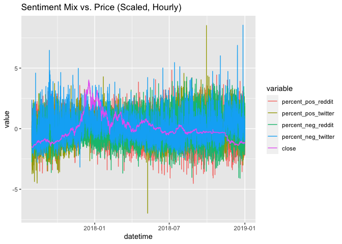
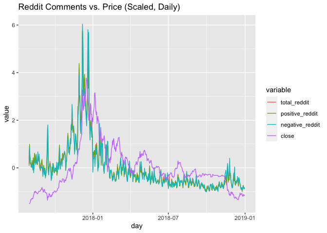
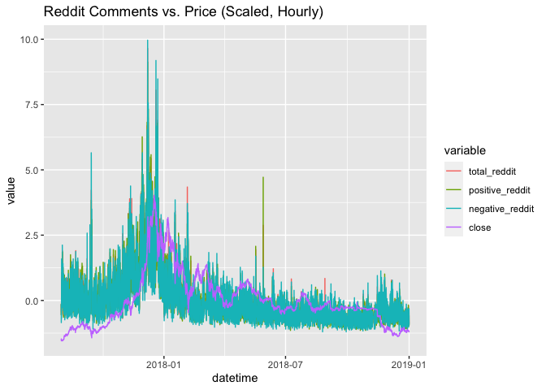
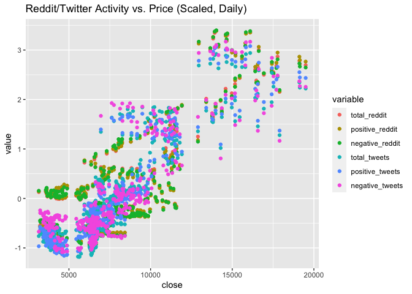
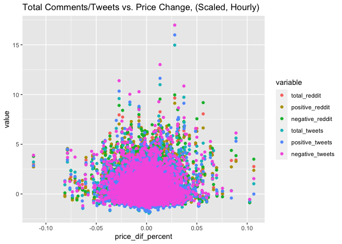

Exploratory Data Analysis
================
2023-04-06

``` r
#install.packages('corrplot')
#install.packages('xts')
suppressPackageStartupMessages({
library(corrplot)
library(xts)
library(vctrs)
library(rlang)
library(kernlab)
library(crypto2)
library('lubridate')
library('dplyr')
library(reshape2)
library(glue)
library(qcc)
library(tidyverse)
library(data.table)
library(ggplot2)
library(RcppRoll)
library(Rcpp)
})
```

``` r
data.daily <- read.csv('../Data/data_daily.csv')[,-1]
data.hourly <- read.csv('../Data/data_hourly.csv')[,-1]
```

``` r
head(data.daily)
head(data.hourly)
```

Now, lets drop the rows that have no information in the close column
(due to the missing price data in the twitter input data. This was
addressed in the data prep Rmd file.)

``` r
data.hourly <-data.hourly[is.na(data.hourly$close) == F,]

data.hourly$datetime <- ymd_hms(data.hourly$datetime)
data.hourly$day <- ymd(data.hourly$day)

data.daily$day <- ymd(data.daily$day)
```

# Data Analysis

As part of our analysis, we want to try different time-shifting
intervals. i.e. does the price of bitcoin at time *t* depend on the
sentiment at time *t-n* where n is the number of period back we shift.
To faciliate this, we will write a function that takes in a dataframe,
and shifts the closing price of bitcoin backwards *n* periods, and
returns a new data frame. This way, when we look at one row of data, we
can see how the sentiment of reddit comments and tweets impact the price
n periods from now.

``` r
shift_df <- function(df, n){
  dfc <- data.table(copy(df))
  cols = c("close")
  anscols = paste("lead", cols, sep="_")

  dfc[order(day), (anscols) := shift(.SD, n, type="lead"), .SDcols=cols]
  dfc <- dfc %>% mutate(price_dif = lead_close - close)
  dfc <- dfc %>% mutate(price_dif_percent = round((lead_close/close) - 1,4))
  dfc <- dfc %>% mutate(price_dir = ifelse(price_dif >=0, 1,0))
  dfc <- dfc[1:(nrow(dfc)-n),]
  dfc
  
}
```

Now, we want to also aggregate hour independent data points back *d*
amount of days. This allows us to answer the following: How does the
sentiment over the last *d* days/hours impact the price of Bitcoin *n*
days/hours from now?

Lets write another function that can do this transformation for us.

``` r
agg_lag_df <- function(df, d){
  
  cols <- colnames(df)
  cols <- cols[! cols %in% c('close','lead_close')]
  e <- nrow(df)
  print(e)
  for (c in cols){
  vname <- glue('{c}')
    df <- df %>% 
      
        mutate( !!vname := roll_sum(.data[[c]], d, align = "right", fill = NA))
  }       

  df <- df[d + 1:(e-d),]
  df
}
```

# Plotting some data

First, lets write a function that takes in a the columns we want to
chart, scales them to have a mean of 0 and standard deviation of 1, and
plots them against each other.

``` r
plot_scaled_data <- function(df, y_cols, x_col, title, t){
  
  df<- data.frame(df)
  
  df[,y_cols] <- scale(df[,y_cols])
  df <- cbind(df[,x_col],df[,y_cols])
  colnames(df)[1] <- x_col
  df <- data.table(df)
  df <- melt(df, id.vars = x_col)
  plt <- ggplot(df,
                aes(x = .data[[x_col]], y = value, color = variable)) + 
         ggtitle(title)
  
  if (t == 'line') {
    plt = plt + geom_line()
  } else if (t == 'scatter'){
    plt = plt + geom_point() 
    
  }
  plt
}
```

## Sentiment Rating (Tweets) vs. Price

``` r
cols <- c('Sent_positives',
          "sent_negatives",
          'close'
          )
data.daily$day <- ymd(data.daily$day)
plot_scaled_data(data.daily, cols, 'day', 'Sent Rating vs. Price', 'line')
```

<!-- -->

``` r
#data.daily[,cols]
```

## Sentiment mix vs. Price

``` r
df <- data.daily


cols <- c('percent_pos_reddit',
          "percent_pos_twitter",
          'percent_neg_reddit',
          'percent_neg_twitter',
          'close')
plot_scaled_data(data.daily, cols, 'day', 'Sentiment Mix vs. Price (Scaled, Daily)', 'line')
```

<!-- -->

``` r
df <- data.hourly
cols <- c('percent_pos_reddit',
          "percent_pos_twitter",
          'percent_neg_reddit',
          'percent_neg_twitter',
          'close')
plot_scaled_data(df, cols, 'datetime', 'Sentiment Mix vs. Price (Scaled, Hourly)', 'line')
```

<!-- -->

Visually inspecting this, it does not appear that the mix of
positive/negative comments/tweets appears to fluctuate in any meaningful
way with the price. We expected to see that when price is climing, the
percent mix of positive comments/Tweets about bitcoin would also
increase. However, this was not the case.

## \# of Comments/Tweets vs. Price

``` r
df <- data.daily
cols <- c('total_reddit',
          "positive_reddit",
          'negative_reddit',
          'close')
plot_scaled_data(df, cols, 'day', 'Reddit Comments vs. Price (Scaled, Daily)', 'line')
```

<!-- -->

``` r
cols <- c('total_tweets',
          "positive_tweets",
          'negative_tweets',
          'close')
plot_scaled_data(df, cols, 'day', 'Tweets vs. Price (Scaled, Daily)', 'line')
```

<!-- -->

``` r
df <- data.hourly

cols <- c('total_reddit',
          "positive_reddit",
          'negative_reddit',
          'close')
plot_scaled_data(df, cols, 'datetime', 'Reddit Comments vs. Price (Scaled, Hourly)', 'line')
```

<!-- -->

``` r
cols <- c('total_tweets',
          "positive_tweets",
          'negative_tweets',
          'close')
plot_scaled_data(df, cols, 'datetime', 'Tweets vs. Price (Scaled, Hourly)', 'line')
```

<!-- -->

These charts are particularly interesting, it seems that the total
number of tweets and comments, regardless of whether they are positive
or negative, seems to very closely track the price of bitcoin. Let’s
plot the total tweet/comment activity against the price of bitcoin on
each day/hour and see if there appears to be any correlation.

``` r
df <- data.daily

df <- agg_lag_df(df,30)
```

    ## [1] 518

``` r
cols <- c('total_reddit',
          "positive_reddit",
          'negative_reddit',
          'total_tweets',
          "positive_tweets",
          'negative_tweets'
          )
plot_scaled_data(df, cols, 'close', 'Reddit/Twitter Activity vs. Price (Scaled, Daily)', 'scatter')
```

<!-- -->

``` r
df <- data.hourly


cols <- c('total_reddit',
          "positive_reddit",
          'negative_reddit',
          'total_tweets',
          "positive_tweets",
          'negative_tweets'
          )
plot_scaled_data(df, cols, 'close', 'Reddit/Twitter Activity vs. Price (Scaled, Daily)', 'scatter')
```

<!-- -->

There seems to be a very noticeable correlation between the converation
activity and the price of Bitcoin. We will want to explore this in our
regression analysis.

## \# of Comments/Tweets vs. Price Changes

Because we are now looking at changes in the price from time t-1 to time
t, we will use a scatter plot rather than a line graph. That is because
our data is no longer a time series, i.e. the price change in one period
is independent of the price change in the previous.

``` r
#Start by shifting the close price n periods
df <- shift_df(data.daily, 1)[1:nrow(data.daily),]


cols <- c('total_reddit',
          "positive_reddit",
          'negative_reddit',
          'total_tweets',
          "positive_tweets",
          'negative_tweets')
plot_scaled_data(df, cols, 'price_dif_percent', 'Comments/Tweets vs. Price Change (Scaled, Daily), Daily', 'scatter')
```

<!-- -->

``` r
df <- shift_df(data.hourly, 1)

cols <- c('total_reddit',
          "positive_reddit",
          'negative_reddit',
          'total_tweets',
          "positive_tweets",
          'negative_tweets')
plot_scaled_data(df, cols, 'price_dif_percent', 'Total Comments/Tweets vs. Price Change, (Scaled, Hourly)', 'scatter')
```

<!-- -->

## 
