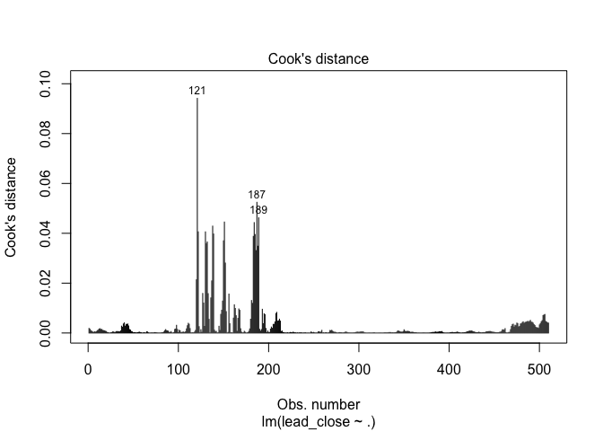

Regression Analysis
================
2023-04-07

# Data Prep

First, lets bring in some packages.

``` r
suppressPackageStartupMessages({
library(corrplot)
library(xts)
library(vctrs)
library(rlang)
library(kernlab)
library(crypto2)
library('lubridate')
library('dplyr')
library(reshape2)
library(glue)
library(qcc)
library(tidyverse)
library(data.table)
library(ggplot2)
library(DAAG)
library(caTools)
library(car)
library(quantmod)
library(MASS)
library(corrplot)
library(caret)
library(RcppRoll)
library(Rcpp)
})
```

Now bring in the data:

``` r
data.daily <- read.csv('../Data/data_daily.csv')[,-1]
data.hourly <- read.csv('../Data/data_hourly.csv')[,-1]
```

Next, lets drop the rows that have no information in the close column
(due to the missing price data in the twitter input data. This was
addressed in the data prep Rmd file.)

``` r
data.hourly <-data.hourly[is.na(data.hourly$close) == F,]

data.hourly$datetime <- ymd_hms(data.hourly$datetime)
data.hourly$day <- ymd(data.hourly$day)

data.daily$day <- ymd(data.daily$day)
```

# Helper Functions

Next, as we did in our data exploration workbook, lets create a function
that allows us to shift the close price *forward* n periods. That way,
when we look at one row of data, we can say that the comment/tweet
activity at time *t-n* is being compared against the closing price at
time *t*.

``` r
shift_df <- function(df, n){
  dfc <- data.table(copy(df))
  cols = c("close")
  anscols = paste("lead", cols, sep="_")

  dfc[order(day), (anscols) := shift(.SD, n, type="lead"), .SDcols=cols]
  dfc <- dfc %>% mutate(price_dif = lead_close - close)
  dfc <- dfc %>% mutate(price_dif_percent = round((lead_close/close) - 1,4))
  dfc <- dfc %>% mutate(price_dir = ifelse(price_dif >=0, 1,0))
  dfc <- dfc[1:(nrow(dfc)-n),]
  dfc
  
}
```

Now, we want to also aggregate hour independent data points back *d*
amount of days. This allows us to answer the following: How does the
sentiment over the last *d* days/hours impact the price of Bitcoin *n*
days/hours from now?

Lets write another function that can do this transformation for us.

``` r
agg_lag_df <- function(df, d){
  
  cols <- colnames(df)
  cols <- cols[! cols %in% c('close','lead_close')]
  e <- nrow(df)
  print(e)
  for (c in cols){
  vname <- glue('{c}')
    df <- df %>% 
      
        mutate( !!vname := roll_sum(.data[[c]], d, align = "right", fill = NA))
  }       

  df <- df[d + 1:(e-d),]
  df
}
```

Since we are going to want to test different lag/lead times to see if
there is any difference in model performance, lets build another
function that takes in:

-   The initial data frame (daily/hourly)

-   A formula

-   A list of intervals we want to test

This function will return a dataframe with one column being the interval
tested and the other being the cross-validated r<sup>2</sup> value.

``` r
run_intervals <- function(df, form, N, response_var){
  
  for (n in N){
    mdf <- shift_df(df, n)
    m <- lm(formula(form), mdf)
    
    print(n)
    print(validate_model(mdf, m, response_var))
  }
  
}
```

# Linear Regression Models

Below, we will build a series of models and evaluate each of them under
the below assumptions:

Since we have 500 + rows and only 7 predictors, we can count out B. That
leaves A.

Our model above failed to consider the assumptions of a linear model.
These are:

1.  Collinearity

2.  Non-linearity of the response-predictor relationships (addressed in
    eda.Rmd)

3.  Correlation of error terms

4.  Non-constant variance of error terms

5.  Outliers

6.  High-leverage points

We will address each of these as we move through this documentation.

## Simple Linear-Linear Model

For our first model, we are going to look at only the features that we
saw were strongly correlated with the price movements of Bitcoin.

``` r
df.daily <- shift_df(data.daily, 1)[,c('lead_close',
           #'close',  
           'total_reddit', 
           'positive_reddit', 
           'neutral_reddit',
           'negative_reddit',  
           'total_tweets', 
           'positive_tweets', 
           'neutral_tweets',
           'negative_tweets')] %>% agg_lag_df(7)
```

    ## [1] 517

``` r
daily.lin_lin <- lm(lead_close ~ ., data = df.daily)
summary(daily.lin_lin)
```

    ## 
    ## Call:
    ## lm(formula = lead_close ~ ., data = df.daily)
    ## 
    ## Residuals:
    ##     Min      1Q  Median      3Q     Max 
    ## -3769.1  -800.1   -64.0   719.8  6351.7 
    ## 
    ## Coefficients: (1 not defined because of singularities)
    ##                   Estimate Std. Error t value Pr(>|t|)    
    ## (Intercept)     1524.46564  250.11392   6.095 2.18e-09 ***
    ## total_reddit      -2.11568    0.18705 -11.311  < 2e-16 ***
    ## positive_reddit    2.75139    0.27770   9.908  < 2e-16 ***
    ## neutral_reddit     3.65989    0.25678  14.253  < 2e-16 ***
    ## negative_reddit         NA         NA      NA       NA    
    ## total_tweets       0.06726    0.01127   5.971 4.48e-09 ***
    ## positive_tweets    0.04419    0.01689   2.616  0.00916 ** 
    ## neutral_tweets    -0.11391    0.01497  -7.610 1.37e-13 ***
    ## negative_tweets   -0.08902    0.01404  -6.341 5.09e-10 ***
    ## ---
    ## Signif. codes:  0 '***' 0.001 '**' 0.01 '*' 0.05 '.' 0.1 ' ' 1
    ## 
    ## Residual standard error: 1344 on 502 degrees of freedom
    ## Multiple R-squared:  0.8208, Adjusted R-squared:  0.8183 
    ## F-statistic: 328.6 on 7 and 502 DF,  p-value: < 2.2e-16

Our first model performed rather well - we can see here that .89% of the
variance in bitcoin price is explained by how much people are talking
about Bitcoin across reddit and Twitter the 7 days before. However,
there are a few things that we need to consider before taking that at
face value. First, we need to validate that model and ensure it was not
overfit. We will do that now. We’ll build a function we can reuse on
other lin-lin models.

``` r
validate_model <- function(df, model){
    
    sample_size <- floor(.8 * nrow(df))

    train <-df[1:sample_size,]
    test <- df[(sample_size +1) :nrow(df),]

  
      
    m <- cv.lm(df, model, m=5, seed=10, printit=F, plotit =F)
    response_var <- summary(model)$call$formula[[2]]
    SSres <- attr(m,"ms")*nrow(df)
    SStotal <- sum((df[[response_var]] - mean(df[[response_var]]))^2)
    rs <- 1- SSres/SStotal
    rs
  
}

t <- validate_model(df.daily, daily.lin_lin)
t
```

    ## [1] 0.8147531

``` r
df.daily <- shift_df(data.daily, 1)[,c('lead_close',
           'positive_reddit', 
           'neutral_reddit',
           'negative_reddit',
           'positive_tweets', 
           'neutral_tweets',
           'negative_tweets')] %>% agg_lag_df(7)
```

    ## [1] 517

``` r
daily.lin_lin <- lm(lead_close ~ ., data = df.daily)
summary(daily.lin_lin)
```

    ## 
    ## Call:
    ## lm(formula = lead_close ~ ., data = df.daily)
    ## 
    ## Residuals:
    ##     Min      1Q  Median      3Q     Max 
    ## -4003.9  -824.7    -9.3   661.0  6497.2 
    ## 
    ## Coefficients:
    ##                   Estimate Std. Error t value Pr(>|t|)    
    ## (Intercept)      2.465e+03  2.009e+02  12.272  < 2e-16 ***
    ## positive_reddit  2.740e-01  8.151e-02   3.361 0.000835 ***
    ## neutral_reddit   1.824e+00  1.573e-01  11.595  < 2e-16 ***
    ## negative_reddit -1.590e+00  1.707e-01  -9.319  < 2e-16 ***
    ## positive_tweets  1.299e-01  9.191e-03  14.137  < 2e-16 ***
    ## neutral_tweets  -3.088e-02  5.728e-03  -5.392 1.08e-07 ***
    ## negative_tweets -5.072e-02  1.291e-02  -3.928 9.74e-05 ***
    ## ---
    ## Signif. codes:  0 '***' 0.001 '**' 0.01 '*' 0.05 '.' 0.1 ' ' 1
    ## 
    ## Residual standard error: 1390 on 503 degrees of freedom
    ## Multiple R-squared:  0.8081, Adjusted R-squared:  0.8058 
    ## F-statistic: 353.1 on 6 and 503 DF,  p-value: < 2.2e-16

``` r
vif(daily.lin_lin)
```

    ## positive_reddit  neutral_reddit negative_reddit positive_tweets  neutral_tweets 
    ##       104.81958        38.58894       107.31695        22.88216        13.32871 
    ## negative_tweets 
    ##        17.33626

``` r
validate_model(df.daily,daily.lin_lin)
```

    ## [1] 0.8017546

``` r
attributes(daily.lin_lin$model)$terms[1]$
daily.lin_lin$call
```

    ## NULL

``` r
formula(daily.lin_lin)
```

    ## lead_close ~ positive_reddit + neutral_reddit + negative_reddit + 
    ##     positive_tweets + neutral_tweets + negative_tweets

Looks like we get a warning here. Some quick research tells us that this
error is telling us one of two things. Either A.) Two predictor
variables are perfectly correlated or B.) You have more model parameters
than observations in the dataset.

### Collinearity

The first assumption we will address is collinearity. That is, the
assumption that our predictor variables are correlated to one another.
Intuitively, we can assume that they are correlated. The features we are
using are the total tweets which is just the total of the positive,
negative, and neutral tweets, and for Reddit, the total comments This is
why our validated model through the error:

    Warning: prediction from a rank-deficient fit may be misleading

Lets investigate this a little. First, we will

``` r
plot(df.daily)
```

<!-- -->

Visually inspecting this, we can see that multicolinearity is very
strong across all of our predictor variables.

Lets first attempt to just remove the total columns, as they are just a
combination of the others.

``` r
df.daily <- shift_df(data.daily, 1)[,c('lead_close',
           'positive_reddit', 
           'neutral_reddit',
           'negative_reddit',
           'positive_tweets', 
           'neutral_tweets',
           'negative_tweets')] %>% agg_lag_df(7)
```

    ## [1] 517

``` r
daily.lin_lin <- lm(lead_close ~ ., data = df.daily)
summary(daily.lin_lin)
```

    ## 
    ## Call:
    ## lm(formula = lead_close ~ ., data = df.daily)
    ## 
    ## Residuals:
    ##     Min      1Q  Median      3Q     Max 
    ## -4003.9  -824.7    -9.3   661.0  6497.2 
    ## 
    ## Coefficients:
    ##                   Estimate Std. Error t value Pr(>|t|)    
    ## (Intercept)      2.465e+03  2.009e+02  12.272  < 2e-16 ***
    ## positive_reddit  2.740e-01  8.151e-02   3.361 0.000835 ***
    ## neutral_reddit   1.824e+00  1.573e-01  11.595  < 2e-16 ***
    ## negative_reddit -1.590e+00  1.707e-01  -9.319  < 2e-16 ***
    ## positive_tweets  1.299e-01  9.191e-03  14.137  < 2e-16 ***
    ## neutral_tweets  -3.088e-02  5.728e-03  -5.392 1.08e-07 ***
    ## negative_tweets -5.072e-02  1.291e-02  -3.928 9.74e-05 ***
    ## ---
    ## Signif. codes:  0 '***' 0.001 '**' 0.01 '*' 0.05 '.' 0.1 ' ' 1
    ## 
    ## Residual standard error: 1390 on 503 degrees of freedom
    ## Multiple R-squared:  0.8081, Adjusted R-squared:  0.8058 
    ## F-statistic: 353.1 on 6 and 503 DF,  p-value: < 2.2e-16

``` r
vif(daily.lin_lin)
```

    ## positive_reddit  neutral_reddit negative_reddit positive_tweets  neutral_tweets 
    ##       104.81958        38.58894       107.31695        22.88216        13.32871 
    ## negative_tweets 
    ##        17.33626

``` r
validate_model(df.daily,daily.lin_lin)
```

    ## [1] 0.8017546

Here we get an r<sup>2</sup> of .6, but our VIF’s are still large.
Looking at the summary, only “negative tweets” has an obviously lower p
value, so there’s not one clear feature we would want to retain.

We have a couple of options here.

1.  Keep only one term, at random

2.  Add interaction terms

3.  Principal Component Analysis

In this exploration, we will try the latter two.

## Interaction Term

For this model, we will try using an interaction term.

For our interaction term, we will use the volume traded at period *t-n*.
Logically, the amount price moves may be tied to not just how much
people are talking about bitcoin, but also how is being traded. For
example, people may be talking very negatively about bitcoin at a given
moment, but what if no one is trading on this information?

``` r
df.daily <- df.daily <- shift_df(data.daily, 1)[,c('lead_close',
           'volume',                                       
           'positive_reddit', 
           'neutral_reddit',
           'negative_reddit',
           'positive_tweets', 
           'neutral_tweets',
           'negative_tweets')] %>% agg_lag_df(7)
```

    ## [1] 517

``` r
 daily.lin_lin.m2 <- lm(lead_close ~ 
                         positive_reddit*volume + 
                         negative_reddit*volume + 
                         neutral_reddit*volume  +
                         positive_tweets*volume +
                         neutral_reddit*volume + 
                         negative_tweets*volume, data = df.daily)
 summary(daily.lin_lin.m2)
```

    ## 
    ## Call:
    ## lm(formula = lead_close ~ positive_reddit * volume + negative_reddit * 
    ##     volume + neutral_reddit * volume + positive_tweets * volume + 
    ##     neutral_reddit * volume + negative_tweets * volume, data = df.daily)
    ## 
    ## Residuals:
    ##     Min      1Q  Median      3Q     Max 
    ## -3163.4  -486.6   104.5   584.1  4828.8 
    ## 
    ## Coefficients:
    ##                          Estimate Std. Error t value Pr(>|t|)    
    ## (Intercept)             2.467e+03  3.648e+02   6.763 3.80e-11 ***
    ## positive_reddit        -1.169e-01  1.287e-01  -0.908 0.364083    
    ## volume                  5.162e-08  9.323e-09   5.536 5.01e-08 ***
    ## negative_reddit        -6.568e-01  2.744e-01  -2.393 0.017060 *  
    ## neutral_reddit          1.269e+00  3.123e-01   4.064 5.60e-05 ***
    ## positive_tweets         5.932e-02  1.335e-02   4.443 1.09e-05 ***
    ## negative_tweets        -1.720e-02  2.119e-02  -0.812 0.417273    
    ## positive_reddit:volume  9.612e-12  1.842e-12   5.218 2.66e-07 ***
    ## volume:negative_reddit -9.553e-12  3.765e-12  -2.537 0.011481 *  
    ## volume:neutral_reddit  -6.122e-12  3.822e-12  -1.602 0.109779    
    ## volume:positive_tweets  5.375e-13  3.445e-13   1.560 0.119364    
    ## volume:negative_tweets -1.811e-12  4.806e-13  -3.768 0.000184 ***
    ## ---
    ## Signif. codes:  0 '***' 0.001 '**' 0.01 '*' 0.05 '.' 0.1 ' ' 1
    ## 
    ## Residual standard error: 1075 on 498 degrees of freedom
    ## Multiple R-squared:  0.8864, Adjusted R-squared:  0.8839 
    ## F-statistic: 353.2 on 11 and 498 DF,  p-value: < 2.2e-16

### Collinearity

``` r
vif(daily.lin_lin.m2)
```

    ## there are higher-order terms (interactions) in this model
    ## consider setting type = 'predictor'; see ?vif

    ##        positive_reddit                 volume        negative_reddit 
    ##              437.09459               23.41577              463.97321 
    ##         neutral_reddit        positive_tweets        negative_tweets 
    ##              254.43323               80.75139               78.10467 
    ## positive_reddit:volume volume:negative_reddit  volume:neutral_reddit 
    ##             1005.62731             1027.82782              451.30357 
    ## volume:positive_tweets volume:negative_tweets 
    ##              829.43487              569.61947

Once again, while we have a very high R<sup>2</sup> value, we also have
very high VIF values still. As such, adding the closing price as an
interaction term does not appear to have given us a better model.

## Principal Component Analysis

Now, we will instead try to reduce the number of variables by using
prinicipal component analysis. This will take all of our features, make
a linear combination of them, and give us a new set of features.

**Note:** PCA is outside of the scope of this assignment, so no further
explanation will be delivered.

``` r
# build a df with all columns, exluding the columns discussed above like total_comments, and the columns relating to bitcoin price. 


df.daily.all <- shift_df(data.daily, 1)[,c('lead_close',
           'volume',                                       
           'positive_reddit', 
           'neutral_reddit',
           'negative_reddit',
           'positive_tweets', 
           'neutral_tweets',
           'negative_tweets')]  %>% agg_lag_df(7)
```

    ## [1] 517

``` r
#replace na's with 0
df.daily.all <- mutate_all(df.daily.all, ~replace_na(.,0))

#perform PCA
df.daily.all.pca <- prcomp(~.,df.daily.all[,!'lead_close'], scale = TRUE)


#scree plot
pca.var.per <- round(summary(df.daily.all.pca)$importance[2,]*100,1)
barplot(pca.var.per,
         main ="Scree Plot (Daily)",
         xlab= "Principal Component",
         ylab = "Percent Variation")
```

<!-- -->

After looking at the resulting models, it appears that using 3 principal
components actually gives us the strongest model, with diminishing
returns after that. As such, we will build a model with 3 PCs and then
evaluate the other assumptions.

``` r
df.daily.all.pca.3 <- as.data.frame(cbind(df.daily.all.pca$x[,1:3],
                                      df.daily.all[,'lead_close']))
   
daily.lin_lin.pca <- lm(lead_close~. ,
                        data = df.daily.all.pca.3)

summary(daily.lin_lin.pca)
```

    ## 
    ## Call:
    ## lm(formula = lead_close ~ ., data = df.daily.all.pca.3)
    ## 
    ## Residuals:
    ##     Min      1Q  Median      3Q     Max 
    ## -4370.3  -537.5   316.0   822.2  6882.0 
    ## 
    ## Coefficients:
    ##             Estimate Std. Error t value Pr(>|t|)    
    ## (Intercept)  7561.62      66.14 114.330  < 2e-16 ***
    ## PC1          1053.92      27.43  38.425  < 2e-16 ***
    ## PC2         -1149.78      76.44 -15.041  < 2e-16 ***
    ## PC3           907.63     116.71   7.777  4.2e-14 ***
    ## ---
    ## Signif. codes:  0 '***' 0.001 '**' 0.01 '*' 0.05 '.' 0.1 ' ' 1
    ## 
    ## Residual standard error: 1494 on 506 degrees of freedom
    ## Multiple R-squared:  0.777,  Adjusted R-squared:  0.7757 
    ## F-statistic: 587.7 on 3 and 506 DF,  p-value: < 2.2e-16

``` r
print('VIF:')
```

    ## [1] "VIF:"

``` r
vif(daily.lin_lin.pca)
```

    ## PC1 PC2 PC3 
    ##   1   1   1

``` r
validate_model(df.daily.all.pca.3,daily.lin_lin.pca)
```

    ## [1] 0.7719919

Now, we have a model with a r<sup>2</sup> of .71, and all VIF are below
5, indicating no multicollinearity! Only thing left to do now is to
cross validate the model:

``` r
validate_model(df.daily.all.pca.3,daily.lin_lin.pca)
```

    ## [1] 0.7719919

#### Correlation of error terms

An important assumption is that error terms e1, e2, ...,en are
uncorrelated. If they aren’t, then we have autocorrelation. To check
this, we will perform a Durbin Watson Test.

``` r
durbinWatsonTest(daily.lin_lin.pca)
```

    ##  lag Autocorrelation D-W Statistic p-value
    ##    1       0.9271541     0.1377863       0
    ##  Alternative hypothesis: rho != 0

Our p value is 0, which means we can reject the null hypothesis and
conclude that the residuals in this regression model are autocorrelated.

Why is this? Durbin- Watson statistic is only suitable for ordered time
or spatial series. Because we transformed our data into cross section
variables with PCA, we cannot use it to detect autocorrelation.
<https://journals.plos.org/plosone/article/file?id=10.1371/journal.pone.0146865&type=printable>

Citation: Chen Y (2016) Spatial Autocorrelation Approaches to Testing
Residuals from Least Squares Regression. PLoS ONE 11(1): e0146865.
<doi:10.1371/journal.pone.0146865>

The impact of autocorrelation on PCA and PCA-based SPC is neither well
understood nor properly documented. As such, for the purposes of this
paper, we will ignore this assumption.

<https://onlinelibrary.wiley.com/doi/full/10.1002/qre.1858>

Vanhatalo, E., and  Kulahci, M. (2016)  Impact of Autocorrelation on
Principal Components and Their Use in Statistical Process
Control. *Qual. Reliab. Engng. Int.*,  32:  1483– 1500.
doi: [10.1002/qre.1858](https://doi.org/10.1002/qre.1858 "Link to external resource: 10.1002/qre.1858").

#### Heteroskedasticity (non-constant variance of error terms)

``` r
plot(daily.lin_lin.pca, which=1)
```

<!-- -->

Here, we can see that there is not a strong pattern emerging. There is
some drift towards the end, however, it is not strongly correlated
outside of a few observations. As such, we conclude our model does not
violate this assumption.

In addition to heteroskedacity, we also want to check and see if our
residuals are normally distirubted and if they are spread equally along
the range of fitted values.

``` r
plot(daily.lin_lin.pca, which=c(2, 3))
```

<!-- --><!-- -->

Here we can see there is not too much skewness in our residuals, meaning
our model is performing well across our entire dataset. We do see some
skewness emerge towards the right of the Q-Q plot, however, it only
appears to be a few points, and thus may be cause by outliers.
Otherwise, the residuals have a pseudo normal distribution.

#### Outliers and High Leverage Points

``` r
plot(daily.lin_lin.pca, which=c(4, 5))
```

<!-- --><!-- -->

Lastly, we look at outliers and leverage. On the first chart, we have
two points that seem to be outliers, as their cooks distance is greater
than .5. We note that one of the points, 121, is the same point on the
Q-Q plot that fell outside of a normall distributed range for residuals.
However, looking at the leverage plot, there are no points that appear
to be high leverage outliers. This means we could likely remove these
points and not have much of an impact on the model. Thus, we conclude
that the points are outliers, but are not impacting the overall model
and do not need to be removed.

## Simple linear Model- Less Variables

In this model, we will attempt a very simple model, removing most of the
variables in attempt to reduce collinearity and see if it holds up to
other assumptions.

``` r
df.daily.all <- shift_df(data.daily, 1)[,c('lead_close',
           'volume',                                       
           'total_reddit',
           'total_tweets')] %>% agg_lag_df(7)
```

    ## [1] 517

``` r
total_models <- lm(lead_close ~ volume +total_reddit+ total_tweets, df.daily.all)
vif(total_models)
```

    ##       volume total_reddit total_tweets 
    ##     2.226124     2.688457     4.206208

``` r
summary(total_models)
```

    ## 
    ## Call:
    ## lm(formula = lead_close ~ volume + total_reddit + total_tweets, 
    ##     data = df.daily.all)
    ## 
    ## Residuals:
    ##     Min      1Q  Median      3Q     Max 
    ## -4062.4  -568.5   282.6   842.4  6844.3 
    ## 
    ## Coefficients:
    ##               Estimate Std. Error t value Pr(>|t|)    
    ## (Intercept)  1.919e+03  1.743e+02  11.010  < 2e-16 ***
    ## volume       7.142e-08  3.917e-09  18.233  < 2e-16 ***
    ## total_reddit 3.244e-02  7.678e-03   4.225 2.83e-05 ***
    ## total_tweets 8.905e-03  1.363e-03   6.532 1.58e-10 ***
    ## ---
    ## Signif. codes:  0 '***' 0.001 '**' 0.01 '*' 0.05 '.' 0.1 ' ' 1
    ## 
    ## Residual standard error: 1464 on 506 degrees of freedom
    ## Multiple R-squared:  0.7857, Adjusted R-squared:  0.7844 
    ## F-statistic: 618.2 on 3 and 506 DF,  p-value: < 2.2e-16

``` r
plot(total_models)
```

<!-- --><!-- --><!-- --><!-- -->

``` r
validate_model(df.daily.all,total_models)
```

    ## [1] 0.7807354

``` r
durbinWatsonTest(total_models)
```

    ##  lag Autocorrelation D-W Statistic p-value
    ##    1       0.9247972     0.1421255       0
    ##  Alternative hypothesis: rho != 0

Here, we see the VIF

# Hourly Models

## Simple Linear Regression

In this section, we will perform the same models as above but using the
hourly data rather than the daily. The analysis of each model will be
the same as above, and will not be elaborated for each model unless a
highly succesful model is found.

``` r
df.hourly <- mutate_all(data.hourly, ~replace_na(.,0))

df.hourly <- shift_df(data.hourly, 1)[,c('lead_close',
           'positive_reddit', 
           'neutral_reddit',
           'negative_reddit',
           'positive_tweets', 
           'neutral_tweets',
           'negative_tweets')] %>% agg_lag_df(6)
```

    ## [1] 11859

``` r
hourly.lin_lin <- lm(lead_close ~ ., data = df.hourly)
summary(hourly.lin_lin)
```

    ## 
    ## Call:
    ## lm(formula = lead_close ~ ., data = df.hourly)
    ## 
    ## Residuals:
    ##      Min       1Q   Median       3Q      Max 
    ## -11093.8  -1263.5     -9.7    989.1  11592.7 
    ## 
    ## Coefficients:
    ##                   Estimate Std. Error t value Pr(>|t|)    
    ## (Intercept)     3503.92101   44.57690  78.604  < 2e-16 ***
    ## positive_reddit    1.73677    0.34214   5.076 3.91e-07 ***
    ## neutral_reddit    17.64257    0.55400  31.846  < 2e-16 ***
    ## negative_reddit  -13.72042    0.64820 -21.167  < 2e-16 ***
    ## positive_tweets    2.01660    0.04499  44.820  < 2e-16 ***
    ## neutral_tweets    -0.29648    0.03067  -9.667  < 2e-16 ***
    ## negative_tweets   -0.47080    0.05579  -8.439  < 2e-16 ***
    ## ---
    ## Signif. codes:  0 '***' 0.001 '**' 0.01 '*' 0.05 '.' 0.1 ' ' 1
    ## 
    ## Residual standard error: 2095 on 11846 degrees of freedom
    ## Multiple R-squared:  0.5346, Adjusted R-squared:  0.5344 
    ## F-statistic:  2268 on 6 and 11846 DF,  p-value: < 2.2e-16

``` r
validate_model(df.hourly, hourly.lin_lin)
```

    ## [1] 0.5340032

``` r
vif(hourly.lin_lin)
```

    ## positive_reddit  neutral_reddit negative_reddit positive_tweets  neutral_tweets 
    ##       32.513993        8.789489       29.399450       11.322364        7.753590 
    ## negative_tweets 
    ##        7.512758

``` r
plot(hourly.lin_lin)
```

<!-- --><!-- --><!-- --><!-- -->

## Interaction Term

``` r
names(data.hourly)[names(data.hourly) == 'volume..btc.'] <- 'volume'
df.hourly <- shift_df(data.hourly, 1)[,c('lead_close',
           'volume',                                       
           'positive_reddit', 
           'neutral_reddit',
           'negative_reddit',
           'positive_tweets', 
           'neutral_tweets',
           'negative_tweets')] %>% agg_lag_df(6)
```

    ## [1] 11859

``` r
hourly.lin_lin <- lm(lead_close ~ 
                         positive_reddit*volume + 
                         negative_reddit*volume + 
                         neutral_reddit*volume  +
                         positive_tweets*volume +
                         neutral_reddit*volume + 
                         negative_tweets*volume, data = df.hourly)
 summary(hourly.lin_lin)
```

    ## 
    ## Call:
    ## lm(formula = lead_close ~ positive_reddit * volume + negative_reddit * 
    ##     volume + neutral_reddit * volume + positive_tweets * volume + 
    ##     neutral_reddit * volume + negative_tweets * volume, data = df.hourly)
    ## 
    ## Residuals:
    ##      Min       1Q   Median       3Q      Max 
    ## -10714.9  -1261.6      6.2    982.2  11547.5 
    ## 
    ## Coefficients:
    ##                          Estimate Std. Error t value Pr(>|t|)    
    ## (Intercept)             3.454e+03  4.427e+01  78.024  < 2e-16 ***
    ## positive_reddit         1.425e+00  3.498e-01   4.074 4.66e-05 ***
    ## volume                  1.905e-07  1.493e-08  12.763  < 2e-16 ***
    ## negative_reddit        -1.403e+01  6.712e-01 -20.904  < 2e-16 ***
    ## neutral_reddit          1.788e+01  5.516e-01  32.413  < 2e-16 ***
    ## positive_tweets         1.783e+00  3.589e-02  49.666  < 2e-16 ***
    ## negative_tweets        -5.763e-01  5.518e-02 -10.444  < 2e-16 ***
    ## positive_reddit:volume  4.879e-10  6.176e-11   7.900 3.03e-15 ***
    ## volume:negative_reddit  8.555e-11  1.085e-10   0.789     0.43    
    ## volume:neutral_reddit  -1.098e-09  1.858e-10  -5.907 3.59e-09 ***
    ## volume:positive_tweets -1.244e-10  1.048e-11 -11.877  < 2e-16 ***
    ## volume:negative_tweets  1.124e-10  1.483e-11   7.579 3.75e-14 ***
    ## ---
    ## Signif. codes:  0 '***' 0.001 '**' 0.01 '*' 0.05 '.' 0.1 ' ' 1
    ## 
    ## Residual standard error: 2069 on 11841 degrees of freedom
    ## Multiple R-squared:  0.546,  Adjusted R-squared:  0.5455 
    ## F-statistic:  1294 on 11 and 11841 DF,  p-value: < 2.2e-16

``` r
 vif(hourly.lin_lin)
```

    ## there are higher-order terms (interactions) in this model
    ## consider setting type = 'predictor'; see ?vif

    ##        positive_reddit                 volume        negative_reddit 
    ##              34.813033              12.095903              32.293734 
    ##         neutral_reddit        positive_tweets        negative_tweets 
    ##               8.927429               7.381678               7.531102 
    ## positive_reddit:volume volume:negative_reddit  volume:neutral_reddit 
    ##             305.340186             242.596963             270.220228 
    ## volume:positive_tweets volume:negative_tweets 
    ##             172.503737             103.792447

``` r
 plot(hourly.lin_lin)
```

<!-- --><!-- --><!-- --><!-- -->

## Principal Component Analysis

``` r
df.hourly.all <- shift_df(data.hourly, 1)[,c('lead_close',
           'volume',                                       
           'positive_reddit', 
           'neutral_reddit',
           'negative_reddit',
           'positive_tweets', 
           'neutral_tweets',
           'negative_tweets')] %>% agg_lag_df(6)
```

    ## [1] 11859

``` r
#replace na's with 0
df.hourly.all <- mutate_all(df.hourly.all, ~replace_na(.,0))

#perform PCA
df.hourly.all.pca <- prcomp(~.,df.hourly.all[,!'lead_close'], scale = TRUE)


#scree plot
pca.var.per <- round(summary(df.hourly.all.pca)$importance[2,]*100,1)
barplot(pca.var.per,
         main ="Scree Plot",
         xlab= "Principal Component",
         ylab = "Percent Variation")
```

<!-- -->

``` r
df.hourly.all.pca.4 <- as.data.frame(cbind(df.hourly.all.pca$x[,1:4],
                                      df.hourly.all[,'lead_close']))
   
hourly.lin_lin.pca <- lm(lead_close~. ,
                        data = df.hourly.all.pca.4)

summary(hourly.lin_lin.pca)
```

    ## 
    ## Call:
    ## lm(formula = lead_close ~ ., data = df.hourly.all.pca.4)
    ## 
    ## Residuals:
    ##      Min       1Q   Median       3Q      Max 
    ## -10956.6  -1604.0     76.5   1065.3  11569.5 
    ## 
    ## Coefficients:
    ##             Estimate Std. Error t value Pr(>|t|)    
    ## (Intercept) 7422.226     21.229  349.62  < 2e-16 ***
    ## PC1          847.809      9.395   90.24  < 2e-16 ***
    ## PC2          167.270     21.556    7.76 9.19e-15 ***
    ## PC3          680.896     26.534   25.66  < 2e-16 ***
    ## PC4          837.222     59.811   14.00  < 2e-16 ***
    ## ---
    ## Signif. codes:  0 '***' 0.001 '**' 0.01 '*' 0.05 '.' 0.1 ' ' 1
    ## 
    ## Residual standard error: 2311 on 11848 degrees of freedom
    ## Multiple R-squared:  0.4333, Adjusted R-squared:  0.4331 
    ## F-statistic:  2265 on 4 and 11848 DF,  p-value: < 2.2e-16

``` r
vif(hourly.lin_lin.pca)
```

    ## PC1 PC2 PC3 PC4 
    ##   1   1   1   1

``` r
plot(hourly.lin_lin.pca)
```

<!-- --><!-- --><!-- --><!-- -->

``` r
validate_model(df.hourly.all.pca.4, hourly.lin_lin.pca)
```

    ## [1] 0.4323254

## Simple Model - Less Variables

``` r
df.hourly.all <- shift_df(data.hourly, 1)[,c('lead_close',
           'volume',                                       
           'total_reddit',
           'total_tweets')] %>% agg_lag_df(6)
```

    ## [1] 11859

``` r
total_models <- lm(lead_close ~ volume +total_reddit+ total_tweets,
                   df.hourly.all)
vif(total_models)
```

    ##       volume total_reddit total_tweets 
    ##     1.028732     2.482024     2.464978

``` r
summary(total_models)
```

    ## 
    ## Call:
    ## lm(formula = lead_close ~ volume + total_reddit + total_tweets, 
    ##     data = df.hourly.all)
    ## 
    ## Residuals:
    ##      Min       1Q   Median       3Q      Max 
    ## -11758.6  -1505.0     48.3   1066.5  11818.7 
    ## 
    ## Coefficients:
    ##               Estimate Std. Error t value Pr(>|t|)    
    ## (Intercept)  3.368e+03  4.811e+01  70.004   <2e-16 ***
    ## volume       6.626e-08  4.806e-09  13.787   <2e-16 ***
    ## total_reddit 1.166e-01  5.727e-02   2.036   0.0418 *  
    ## total_tweets 4.481e-01  7.632e-03  58.715   <2e-16 ***
    ## ---
    ## Signif. codes:  0 '***' 0.001 '**' 0.01 '*' 0.05 '.' 0.1 ' ' 1
    ## 
    ## Residual standard error: 2285 on 11849 degrees of freedom
    ## Multiple R-squared:  0.4461, Adjusted R-squared:  0.446 
    ## F-statistic:  3181 on 3 and 11849 DF,  p-value: < 2.2e-16

``` r
plot(total_models)
```

<!-- --><!-- --><!-- --><!-- -->

``` r
validate_model(df.hourly.all,total_models)
```

    ## [1] 0.445366

``` r
run_intervals <- function(df, form, N){
  r2 <- c()
  for (n in N){
    mdf <- shift_df(df, n)
    m <- lm(formula(form), mdf)
    
    print(summary(m)$r.squared)
    r2[n] <- summary(m)$r.squared
    r2
  }
  
}
```

``` r
intervals <- run_intervals(data.daily,
              form = 'log(lead_close) ~ volume +total_reddit+ total_tweets',
              N = c(1,12,18,24))
```

    ## [1] 0.5798776
    ## [1] 0.5206987
    ## [1] 0.4763396
    ## [1] 0.4407609
